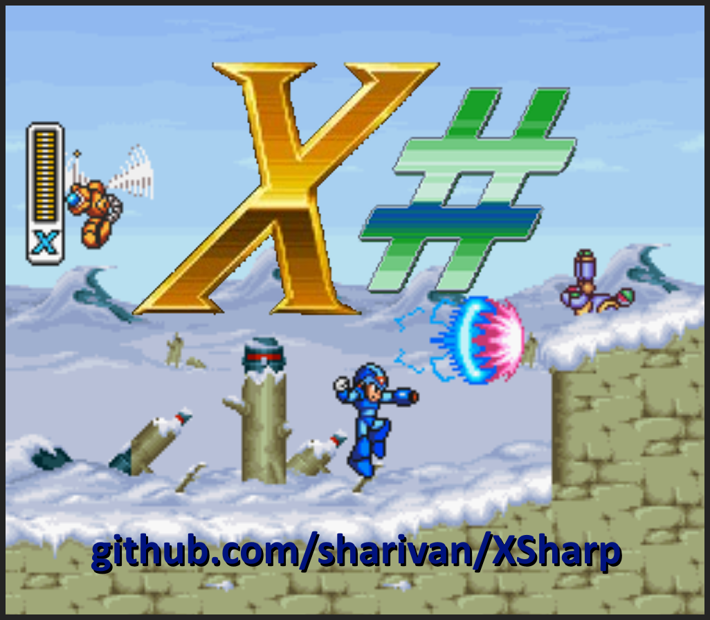

# **X# Engine**

This project aims to recreate an engine very similar to the SNES Mega Man X trilogy. You can test the executable version of this project by downloading the current release accessing https://github.com/sharivan/XSharp/releases. You will need the .NET 7.0 or newer to run this program.

You can control the X using the following keys:

  - X: Dash.
  - C: Jump.
  - V: Shoot X-Buster.
  - Left Arrow: Move to Left.
  - Right Arrow: Move to Right.
  - Enter: Toggle pause.

Support to joypad was added, but there is no support to bind custom keys for now.

Shortcut Keys:

  - Pause/Break: Toggle frame advance.
  - |: Next frame, if in frame advance mode. Otherwise, start the frame advance mode.
  - F5: Save state.
  - F7: Load state.
  - =: Next save slot.
  - -: Previous save slot.
  - N: Toggle no clip.
  - M: Toggle no camera constraints.
  - 1: Toggle draw hitbox.
  - 2: Toggle show colliders.
  - 3: Toggle draw level bounds.
  - 4: Toggle draw touching tilemap bounds.
  - 5: Toggle draw highlighted pointing tiles (with mouse cursor).
  - 6: Toggle draw axis from X origin.
  - 7: Toggle show info.
  - 8: Toggle show checkpoint bounds.
  - 9: Toggle show trigger bounds.
  - F1: Toggle background.
  - F2: Toggle foreground down layer.
  - F3: Toggle foreground up layer.
  - F4: Toggle sprites.

Modifications currently in progress:

- Bosses.
- Lua scripting support, allowing devs and mappers customize levels, enemies, etc.
- Own level format (instead loading from rom of original games). This step is neeeded to make the level editor.
- More levels for testing.
- More types of enemies.
- Armors.
- Water graphics.
- Slippery physics (present in Crystal Snail and Blizzard Buffalo stages).
- Conveyor physics (present in Mammoth and Sigma 3 stages).
- Solid based sprites (elevators, moving platforms, etc).

Some Pending Fixes:

- Fix background position in some levels.
- Fix triggers and camera lock in some levels.
- Fix camera transitions.

Future additions:

- Further polishing of physics.
- Level editor.
- Pause menu.
- Weapons.
- Demo recorder.
- Embedded console.
- Support for other render APIs like D3D11 and OpenGL.
- Add documentation.
